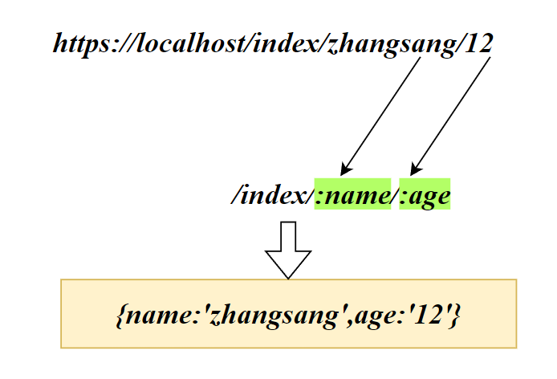
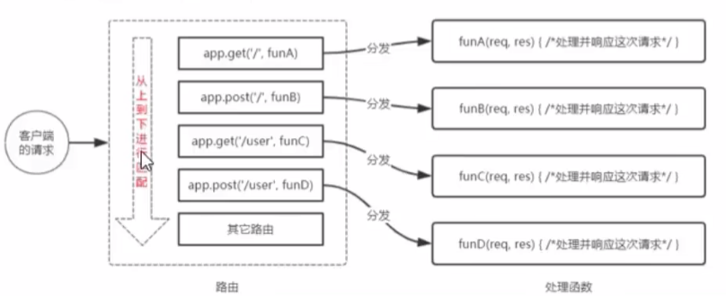

# Express模块

## Express简介


express是基于node.js平台的Web开发框架。express的作用与node.js内置的http模块类似，与Java中的Tomcat类似

Express可以提高node.js中开发Web开发效率

安装Express模块：

```sh
npm i express@4.17.1
```

## 创建Web服务器

```js
const express = require('express');
//创建Web服务器
const app= express()
app.listen(80,()=>{
    console.log('express running at loaclhost:80 ......');
})
```

## 监听 get和post

- 监听GET请求

```js
app.get(请求URL,function (req,res) {
    //处理函数
})
```

- 监听POST请求

```js
app.post(请求URL,function (req,res) {
    //处理函数
})
```

- 获取URL

使用request的对象的`url`属性获得请求的URL（不包含主机地址）

- 响应

使用response对象的`send`方法响应信息（string、JSON）

```js
res.send(信息)
```

# request

## query

- 获取GET请求的参数，默认情况下`req.query()`得到的是空对象`{}`

```js
req.query
```

query会将GET参数封装成JS对象

```js
// ?name=lai&age=12
req.query
//{ name: 'lai' }
```

## params

- 获取URL中的动态参数

  URL中的:匹配到的参数，req.params默认为空对象

```js
req.params
```



```js
// url=/index/12''
app.get(‘/index/:id',function (req,res) {
    console.log(req.params)
})
```

> {id:'12'}

# response

## send()

### 发送纯文本

```js
res.send('Hello, World!'); // 发送文本响应
```

### 发送HTML文本

```js
res.send('<h1>This is an HTML response</h1>'); // 发送 HTML 响应
```

浏览器将解析其中的HTML元素

### 发送JS对象

如果您使用 res.send() 发送一个 JavaScript 对象，浏览器将收到 JSON 格式的响应。Express 会自动设置响应的 Content-Type 为 "application/json"，并将 JavaScript 对象转换为 JSON 格式的字符串，然后发送给浏览器。

```js
res.send({name:'lai'})
```

> Chrome：
>
> {
>
>   "name": "lai"
>
> }

# 托管静态资源

## 托管静态资源

```js
app.use(express.static(静态资源目录))
```

托管后，浏览器可以随意访问该目录下的所有文件

浏览器访问的静态资源的URL将不再出现该目录。Express将从该目录中，根据URL获取相应的静态资源：

```js
app.use(express.static('./static'))
```

```js
url='localhost/css/style.css'
url='localhost/img/img1.jpg'
```

*Express*将会在static中寻找`/css/style.css`和`/img/img1.jpg`

可以托管多个目录作为静态资源目录，Express将**根据声明的顺序去查找静态资源**

```js
app.use(express.static('./static'))
app.use(express.static('./public'))
```

## 挂载路径前缀

如果我们希望客户端访问静态资源时需要带有一个指定的前缀的URL，我们可以挂载路径前缀

```js
app.use('/file',express.static('./static'))
```

`localhost/css/style.css`变成了`localhost/file/css/style.css`

# nodemon

在node.js中修改了项目的代码，需要我们重新运行JS服务器程序，我们可以使用nodemon动态监听项目中代码的变动，就不再需要重启服务器了

```sh
npm install -g nodemon
```

启用nodemon监听并运行：

```sh
nodemon app.js
```

# 路由

路由是一种映射关系，根据不同的URL映射（分发）到不同的处理函数

## Express路由

Express路由指的是客户端请求与服务器函数之间的映射关系

Express中的路由由请求类型、请求URL、处理函数构成

```js
app.METHOD(PATH,HANDLER)
```

HANDLER：处理函数

PATH：URL路径

METHOD：请求类型

```js
app.get('/',function(req,res){
    //处理函数
})
```

```js
app.post('/',function(req,res){
    //处理函数
})
```



> **Bug:**
>
> webstorm中router.get和router.post无法解析
>
> **Answer：**
>
> 在express处按下Alt+Enter，安装TypeScript

## 路由模块化

路由模块化：将功能类似的函数封装至单独的一个模块，方便对路由进行模块化管理

Express不建议将路由直接挂载到app上，而是推荐将路由抽离为单独的模块

每个功能就是一个路由模块，我们可以在主程序中引入这些路由mo'k

- 将路由功能单独抽离成一个模块：

```js
const express = require('express');
const router = express.Router();
//挂载路由
router.get('/index',function (req,res) {
    res.send('hello world')

})
router.post('/index',function (req,res) {
    res.send('hello world')

})
module.exports=router
```

- 服务器程序中引入router模块，使用app.use即可注册该路由模块

```js
const express = require('express');
//创建Web服务器
const app= express()
const router =require('./router')
app.listen(80,()=>{
    console.log('express running at localhost:80 ......');
})

app.use(router)
```

一个router模块就当于路由器的路由表一样

app.use用于注册全局中间件

## 挂载路径前缀

路由也可以挂载指定前缀

```js
app.use('/user',router)
```

当访问该router中的path，需要带有指定前缀：/user

`localhost/index` -> `localhost/user/index`

