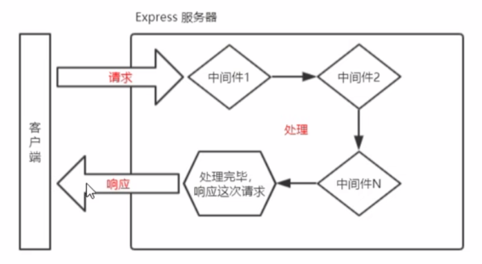

# Express中间件

此部分说的中间件指的是EXpress服务器上的中间处理的模块



Express中间件本质上就是一个**function处理函数**


## 创建Express中间件


```js
app.use(中间件路径,中间件)
```

- function：中间件函数

中间件函数必须包含`next`参数，路由处理函数只需要包含req，res

## 中间件函数

router就是一个中间件，我们也可以自己创建一个中间件

```js
const fun=function(req,res,next){
    console.log('经过了fun中间件')
    next()
}
```

- next

`next`是一个函数，next函数是实现多个中间件连续调用的关键，他可以把流转关系转交给下一个中间件或路由。

`next`函数是每一个中间件必须要有的语句，且需要放置在中间件函数的最后

## 中间件作用

**多个中间件之间共享同一份req和res**，我们可以在上游的中间件中，统一为req和res对象添加属性成员和方法成员，供下游的中间件使用。

例如添加全局中间件：添加访问时间至`req`，并返回该时间

# 全局中间件

## 注册全局中间件

客户端发起的**任何请求**到达服务器之后都会触发的中间件称为全局中间件

在注册中间件时，只需要不填写中间件访问的路径（前缀）就可以声明一个全局中间件了

```js
app.use(中间件函数)
```

```js
app.use(function (req, res, next) {
    res.send('我是全局中间件')
    next()
})
```

## 全局中间件顺序

可以使用`app.use()`连续定义多个全局中间件，客户端请求到达服务器之后，会按**照中间件定义的先后顺序**依次进行调用

```js
app.use(function (req, res, next) {
    console.log('第一个中间件');
    next()

})
app.use(function (req, res, next) {
    console.log('第二个中间件');
    next()

})
```

> 第一个中间件
> 第二个中间件

# 局部中间件

## 定义局部中间件

### app.use【不常使用】

在创建中间件时，指定中间件的路径，即可创建一个局部中间件

```js
app.use('/special', (req, res, next) => {
    //函数体
    next();
});
```

当URL前缀为`/special`时，将会触发该中间件

### app.method

当创建路由时，也可以声明一个或多个中间件。我们可以称为路由所属中间件，当触发路由之前，将执行这些路由中间件

```js
const m1=function (req,res,next) {
    next()
}
app.get('/other',m1,function (req,res) {
    res.send('message')
})
```

这个中间件只会在当前路由生效。执行顺序为m1->路由处理函数

也可以声明多个路由中间件，路由中间件的顺序按照声明的先后顺序执行

- 写法一：

```js
app.get('路由URL',[中间件1,,中间件2,...],(req,res)=>{
    //路由处理函数
})
```

- 写法二：

```js
app.get('路由URL',中间件1,中间件2,...,(req,res)=>{
    //路由处理函数
})
```


```js
app.use('/special', (req, res, next) => {
    req.name='lai'
    next();
});
app.get('/special/index',(req, res)=>{
    req.name=req.name+12
    res.send(req.name)
})
```

> lai12

# 中间件分类

## 应用级别中间件

通过app.use()，或app.method绑定到app实例上的中间件叫做应用级别中间件

## 路由级别中间件

绑定到express.Router实例上的中间件，叫做路由级别中间件，路由级别的中间件是绑定到router实例上的

```js
router.use(中间件函数)
```

