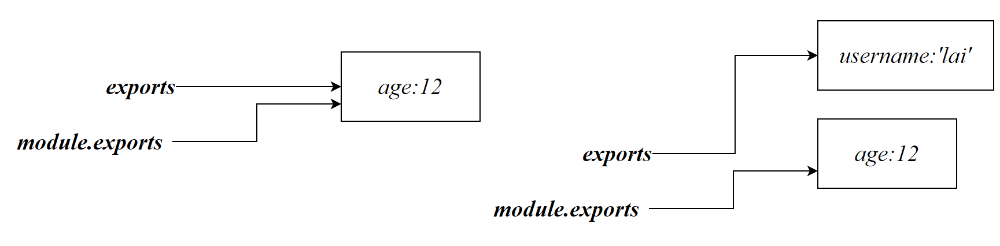
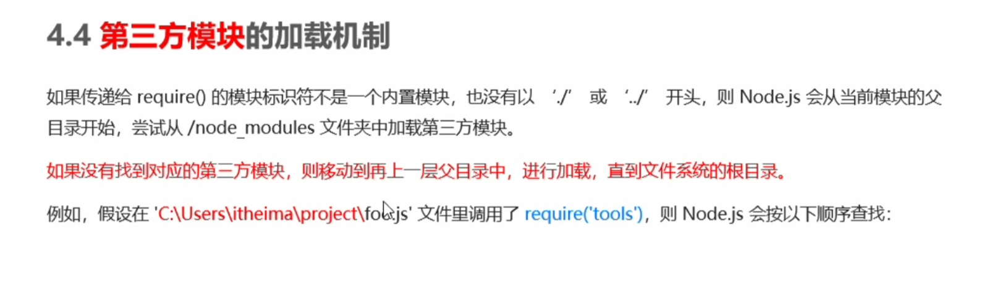

# 模块

## 基本概念

类似于Java中的jar包，由其他开发者编写并分享。

- 内置模块

fs模块，path模块，http模块都由node.js提供，并内置于node中

- 自定义模块

用户创建的每一个JS文件，都是自定义模块

- 第三方模块

第三方开发者编写的JS代码

## 加载模块

加载模块可以省略`.js`后缀

```js
require(模块名)
```

```js
require('js')
```

加载用户自定义模块

```js
require(模块的相对路径)
```

```js
require('./my.js')
```

加载第三方模块

```js
require('moment')
```

**模块加载后，会执行模块内的代码**

```js
//my.js
console.log('模块被加载')
```

```js
//test.js
const my=require('./my.js')
```

> 模块被加载

## CommonJS规范


# 模块作用域

## 作用域

在自定义模块中定义的变量、方法等成员只能在当前模块内被访问，这种模块级别的访问限制称为模块作用域

模块作用域可以防止全局变量的污染

```js
//my.js
const username='张三'
function say(){
    console.log('模块被加载')
}
```

```js
//test.js
const my=require('./my.js')
console.log(my)
//空对象{ }
```

## 共享模块作用域的成员

每一个JS文件中都默认存在一个`module`对象，他存储了当前模块有关的信息

```js
{
  id: '.',
  path: 'E:\\Doc\\Markdown\\node\\code\\part1\\modscope',
  exports: {},
  filename: 'E:\\Doc\\Markdown\\node\\code\\part1\\modscope\\my.js',
  loaded: false,
  children: [],
  paths: [
    'E:\\Doc\\Markdown\\node\\code\\part1\\modscope\\node_modules',
    'E:\\Doc\\Markdown\\node\\code\\part1\\node_modules',
    'E:\\Doc\\Markdown\\node\\code\\node_modules',
    'E:\\Doc\\Markdown\\node\\node_modules',
    'E:\\Doc\\Markdown\\node_modules',
    'E:\\Doc\\node_modules',
    'E:\\node_modules'
  ]
}
```

`exports`可以共享模块作用域中的成员供外界使用

```js
module.exports
```

当外界使用`require`方法导入模块得到的就是`module.exports`所指向的对象

默认情况下`module.exports={}`

共享成员/方法：

相当于在exports对象中添加新的成员/方法

```js
module.exports.成员/方法
```
在exports中创建一个`username`成员，不影响全局变量`username`
```js
const username='张三'
console.log(module)
module.exports.username='李四'
```

等价于

```js
const username='李四'
module.exports.username=username
```

```js
const my=require('./my.js')
console.log(my.username)
//李四
```

也可以直接将一个对象赋值给`module.exports`

```js
module.exports={
    username:'lai',
    sayhello(){
        console.log('hello')
    }
}
```

## exports对象

node提供了`exports`对象简化了`module.exports`的书写，初始时两者指向了**同一个空对象**

```js
exports.username='lai'
```

后续两个指针变量的改变互不不影响，共享的成员以`module.exports`指向的对象为准

```js
module.exports.age=12
exports={username='lai'}
//共享的成员：{age:12}
```



实际上只要不随意将对象赋值给`module.exports`或`exports`，两者指向的都是同一个对象

也可以只使用其中一个变量，就不会造成混乱


# 包

Node.js中的第三方模块也称为包

## npm

www.npmjs.com是全球最大的包共享平台，可以搜索相关的包信息

https://www.registry.npmjs.org/：npm提供的包下载服务器

## Download

npm提供了包管理工具：Node Package manager ，简称npm包管理工具，可以下载相关的包

终端中输入以下命令查看npm的版本

```shell
npm -v
```

以安装时间格式化模块为例

- 安装包

  ```shell
  npm install 包完整名称
  #简化版本
  npm i 包完整名称
  #下载指定版本
  npm i 包完整名称@版本
  ```

  ```shell
  npm install  moment
  ```

  

- 导入包

  ```js
  const moment = require('moment');
  ```

  

- 卸载包

  ```js
  npm uninstall 包名
  ```

## node_modules

该文件夹用来存放所有已安装到**项目**中的包。每一个项目都有一个node_modules。一个项目中的包的版本是唯一的，不存在一个包两个版本的情况

`package-lock.json`记录了每一个包的信息

## 版本号语义

第一位数字：大版本

第二位数字：功能变化

第三位数字：Bug修复版本

```js
2.1.2
//第一次功能变化的第二次Bug修复
```

当前一位版本号增长了，后面的版本号需要归0

## package.json

npm规定，在项目的根目录，必须提供一个`package.json`的包管理配置文件记录配置信息

例如：项目的名称、版本号、描述。类似于Maven的`pom.xml`

团队协作中只需要共享项目源代码和`package.json`即可，package.json记录了项目中所使用的包，项目能够自动下载相应的包

手动生成`package.json`

```js
npm init -y
```

当项目中缺少所使用的依赖，运行该命令，将读取package.json的信息并自动下载依赖

```shell
npm install
```

### dependencies

记录了所有阶段使用的包的信息

### devDependencies

某些包只在开发阶段使用，上线之后不会用到，可以将这些包记录到devDependencies节点中

```shell
#安装至devDependencies节点中
npm i  -D 包名
```

```json
  "dependencies": {
    "moment": "^2.29.4"
  },
  "devDependencies": {
    "webpack": "^5.89.0"
  }
```

### main

一个包通常是一个目录，main属性指定了包的入口

```sh
require('包名')
```

require会去寻找该包下的`package.json`并读取`main`属性所指向的JS文件

### name

包名。最终生成的包名由该属性决定与项目目录名称无关。

包名要求唯一，因为需要发布至npm仓库。

### keywords

npm仓库介绍中的关键字，方便搜索


## 更换镜像源

解决下载速度慢的问题

- 查看仓库配置

```sh
npm config get registry
```

- 切换taobao镜像源

```sh
npm config set registry=https://registry.npm.taobao.org/
```

### nrm

nrm为npm的镜像管理工具，可以方便更改镜像源

- 安装nrm

```sh
npm i nrm -g
```

- 查看镜像列表

```sh
nrm ls
```

>   npm ---------- https://registry.npmjs.org/
>   yarn --------- https://registry.yarnpkg.com/
>   tencent ------ https://mirrors.cloud.tencent.com/npm/
>   cnpm --------- https://r.cnpmjs.org/
>   taobao ------- https://registry.npmmirror.com/
>   npmMirror ---- https://skimdb.npmjs.com/registry/

- 切换源

```sh
nrm use 源名称
```

## 项目包

被安装至`node_module`目录中的包称为项目包，每一个项目都有`node_module`目录

## 全局包

执行包安装时，提供 -g选项表示将包安装为全局包


工具包例如nrm，可以安装在全局中。每个包都有推荐的安装命令，可参考官方文档

# 发布包

## npm 本地登录

需要将仓库地址切换为npm官方地址

```sh
npm login 
```


## 功能分割


## 发布包

在项目根目录（package.json所在目录）下运行：

```sh
npm  publish
```


在账号下的packages下便可以查看发布至npm的包，包名必须在npm中唯一

## 包删除

删除已发布的包

```sh
npm unpublish 包名 -force
```

npm不鼓励任何形式的删除，主要因为我们发布的包可能已经被其他人引用，如果我们删除了此包，其他人在重新安装含有我们包的依赖的工程时，出现找不到包问题。

基于此，npm做了相关的删除限制：

- 删除的版本24小时后方可重发!
- 只有发布72小时之内的包可以删除!

我们有责任和义务维护每一个社区的纯净

# 模块加载机制

## 模块缓存


## 第三方模块加载机制




## 目录作为模块

模块可以是一个JS文件或一个目录


